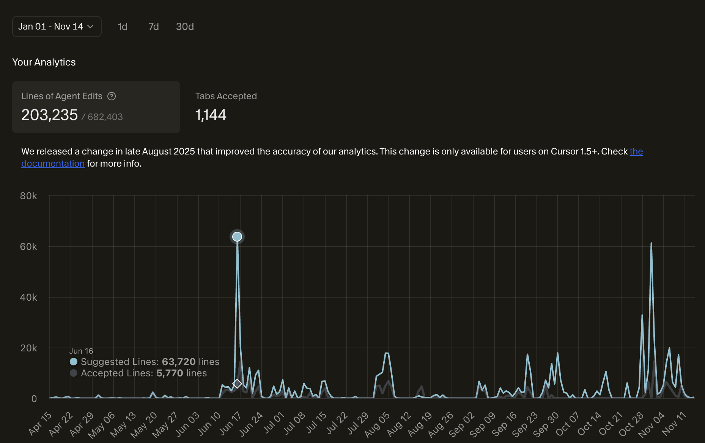

# Playbook for Vibe Coding with Cursor (for Engineers) without Heavy Setup
A practical, "lazy" workflow for shipping software quickly—without heavy setup, complex agents, or rule fatigue.

## Why This Playbook Exists

There are now many “vibe coding” guides — some great, some wildly overengineered.

This one is different.

- ❌ No custom commands
- ❌ No special folder structures
- ❌ No multiple agents
- ❌ No "rules" to remember
- ❌ No heavy initial setup

I wrote this because most engineers (including me) prefer a workflow they can actually remember and use daily, not a giant system they abandon after Day 2.

This playbook is:

- ✔ practical
- ✔ minimal
- ✔ fast
- ✔ based on real engineering work (200k+ AI-generated lines reviewed this year)
- ✔ optimized for Cursor users

If you want something that helps you build fast, debug reliably, and stay sane, this is it.

## Who am I?

**[Yuto](https://x.com/yuto_samurai_ai)**

I write a lot of code with AI (Cursor). In 2025 alone, Cursor generated over 600,000 lines of code for me, and I reviewed and accepted over 200,000 lines into my codebase.

## Overview of my vibe coding flow

In general, here is my workflow for AI coding (or "vibe coding"). It breaks down into five distinct phases:

1. **High-Level Planning:** Deciding what to build (functionality) and how to build it (architecture decisions).
2. **Spec Planning:** Zooming in for feature-level planning and writing detailed specifications.
3. **AI Code Generation:** Writing the actual code with AI tools.
4. **Review & Debug:** A mix of AI-assisted review and manual code auditing.
5. **Final Gate:** Creating a Pull Request for the final sanity check.

## High-Level Planning

**Tool:** Gemini 3.0

**The Action:** I chat with Gemini 3.0. I treat it like a Staff Engineer. We argue about architecture until I have a clear list of requirements.

**The Setup:** None. Just a browser tab.

If you already know exactly what feature you want to build next, you can skip this section.

However, when I build something big or complex, I always start here. Sometimes I have a clear sense of the requirements, and sometimes I don't. Regardless, I use a generic LLM (like Gemini or ChatGPT) to brainstorm first. Right now, I use Gemini 3.0 to discuss my ideas and solidify exactly what needs to be built.

## Spec Planning

**Tool:** Cursor (Planning Mode) / Gemini 3.0

When you are ready to implement a specific feature and have a clear idea of what to build, this is where you start.

### My Workflow

1. **Draft:** I type my initial idea into Cursor's Planning Mode. Cursor usually asks clarifying questions or generates a spec (.md file).
2. **Cross-Check:** I copy that plan and paste it into Gemini 3.0 to ask for improvements or edge cases I missed.
3. **Refine:** I feed Gemini's feedback back into Cursor to update the plan.
4. **The Manual Review:** Finally—and most importantly, I review the plan manually to catch hallucinations. I specifically check three things:
   - **Functionality:** Is it actually building what I want?
   - **Structure:** Is it writing code in the correct files and reusing existing functions (DRY)?
   - **Feasibility:** Do the step-by-step implementation instructions make logical sense?

## AI Code Generation

**Tool:** Cursor Agent

At this point, you should have a plan.md file in Cursor. I usually press the Build button and let Cursor start coding.

I prefer using Agent Mode for this. As long as the feature is small and the plan is precise, the Agent usually works fine. Even though it sometimes gets stuck or creates bugs, I prefer this workflow: I let the Agent do the heavy lifting of writing the code, and I spend my energy on reviewing and fixing it.

## Review & Debug

**Tool:** Cursor

- **Automated Testing:** I ask Cursor to write/update tests and confirm they pass within the chat.
- **Manual Testing:** I run the app locally (e.g., `npm run dev`) to verify the "vibe."

When it breaks (and it usually does), I follow this protocol:

- **If it's a "Style/Simple" bug:** I tell Cursor exactly what to change (e.g., "move the button left").
- **If it's a "Logic" bug:** I stop prompting. I read the code manually, find the root cause myself, and then give Cursor a hint.

> **Note:** This specific pain point—digging for root causes in AI code—is why I am building my own product. (See the profile of my X/Twitter at the top).

**Key Takeaway:** You must read the code manually at this high level. Do not blindly trust the agent to debug itself.

## Final Gate

**Tool:** CodeRabbit / Greptile

Once the code passes local tests, I make a Pull Request. My PR workflow uses CodeRabbit and Greptile for a final automatic sanity check.

- **Automated Review:** If CodeRabbit or Greptile flags a critical error, I copy the feedback into Cursor to fix it quickly.
- **Manual Review:** Even with these tools, I manually review the main code changes myself to see exactly what is happening.

**I cannot stress this enough:** relying solely on AI is dangerous. Manual review is the only way to maintain a healthy codebase in the long run.

---

If this "No-Setup" playbook helped you, give it a ⭐️ star!
